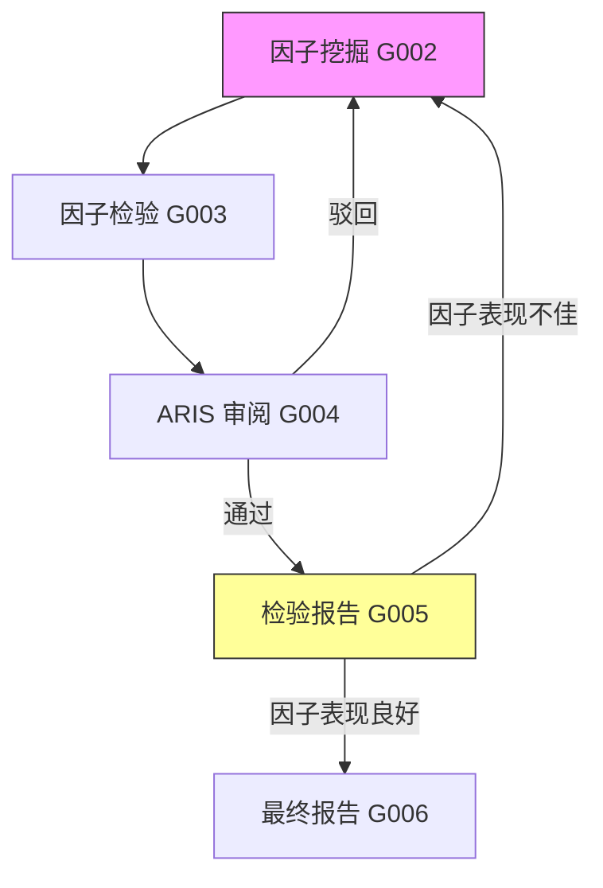

# 量化因子挖掘与 ARIS 迭代工作流设计

## 一、整体架构

```
                         ┌──────────────────────────┐
                         │    G001: 文献调研与因子池    │
                         │  (research-lit + arxiv +   │
                         │   semantic-scholar)        │
                         └───────────┬──────────────┘
                                     ▼
                         ┌──────────────────────────┐
                         │    G002: 数据挖掘因子       │
                         │  (experiment-bridge +      │
                         │   run-experiment + 编码)    │
                         └───────────┬──────────────┘
                                     ▼
                         ┌──────────────────────────┐
                         │    G003: 因子检验与回测      │
                         │  (analyze-results +         │
                         │   统计检验脚本)              │
                         └───────────┬──────────────┘
                                     ▼
                ┌────────────────────────────────────┐
                │    G004-aris: ARIS 对抗迭代审阅     │◄──────────┐
                │  (auto-review-loop → 跨模型审阅)     │           │
                └───────────┬────────────────────────┘           │
                            │                                    │
                     ┌──────▼──────┐                      ┌──────┴──────┐
                     │  审阅通过？   │                     │  审阅不通过   │
                     └──────┬──────┘                     └──────┬──────┘
                            │ 是                               │ 否
                            ▼                                  │
                ┌──────────────────────────┐                    │
                │    G005: 多种检验报告      │                    │
                │  (paper-figure +          │                    │
                │   paper-write +           │                    │
                │   analyze-results)        │                    │
                └───────────┬──────────────┘                    │
                            │                                    │
                     ┌──────▼──────┐                             │
                     │  检验结果OK？  │──── 否 ─────────────────────┘
                     └──────┬──────┘     回到 G002 换方法
                            │ 是
                            ▼
                ┌──────────────────────────┐
                │    G006: 最终研究报告      │
                │  (paper-write +           │
                │   paper-compile +         │
                │   结果归档)                │
                └──────────────────────────┘
```

## 二、技能映射表

| 环节 | 所需 Skill | 功能 |
|------|-----------|------|
| **G001 文献调研** | `/research-lit` | 多源文献综述（Zotero + arXiv + S2 + web） |
| | `/semantic-scholar` | 已发表论文检索（含引用数、TLDR） |
| | `/arxiv` | arXiv 预印本检索 |
| | `/research-wiki` | 因子知识库持久化管理 |
| **G002 因子挖掘** | `/experiment-bridge` | 实验计划 → 可运行代码（W1.5 桥接） |
| | `/run-experiment` | 部署和运行 ML 实验 |
| | `/experiment-queue` | 多配置并行实验队列 |
| **G003 因子检验** | `/analyze-results` | 实验结果统计、对比表、可视化 |
| | 金融插件 `financial-analysis` | 金融数据处理辅助 |
| **G004 ARIS审阅** | `/auto-review-loop` | 跨模型对抗审阅（核心：执行者≠审阅者） |
| | `/experiment-audit` | 实验完整性审计 |
| | `/result-to-claim` | 结果→科学主张映射 |
| **G005 检验报告** | `/auto-因子图表` | 生成出版物质量图表（IC时序、累计收益、热力图） |
| | `/auto-因子评估` | 基于 IC/IR/Sharpe/FM t-stat 评估因子有效性 |
| | `/auto-因子报告` | 因子报告撰写 |
| | `workflow_orchestrator --mode report` | HTML 渲染（含内联CSS、KPI卡片、响应式布局） |
| | `workflow_orchestrator --mode figures` | 批量生成24张图表（含IC衰减图） |
| **G006 最终报告** | `/auto-因子报告` | 综合报告撰写 |
| | `workflow_orchestrator --mode report` | HTML 渲染 |
| | `/kill-argument` | 200 字最强拒稿测试 |

## 三、ARIS 跨模型对抗机制

ARIS 的核心：**执行者 ≠ 审阅者（必须跨模型家族）**

```
┌─────────────────────────────────────────────────┐
│               auto-review-loop 流程               │
├─────────────────────────────────────────────────┤
│  Round 1: Claude Code 实现因子挖掘代码            │
│  Round 2: GPT（via Codex MCP）审阅代码 & 结果     │
│  Round 3: Claude 根据审阅意见修改                 │
│  Round 4: 再次审阅 → 通过 or 继续迭代              │
│  最多 3 轮，否则触发人工介入                        │
└─────────────────────────────────────────────────┘
```

## 四、质量门禁（5 层审计）

```
G003→G004 入口审计：experiment-audit（代码诚实性）
G004 审阅中：result-to-claim（主张是否来自数据）
G005→G006 审计：paper-claim-audit（数字是否真实）
G006 定稿前：citation-audit（每条引用有效）
G006 终审：kill-argument（最强拒稿测试）
```

## 五、迭代回溯机制



回溯条件：
1. **G004 ARIS 审阅不通过** → 修复代码/方法，重新挖掘
2. **G005 检验报告显示因子表现不佳**（IC 不显著、多空收益不显著等）→ 换因子组合/方法论
3. **连续 3 轮回溯仍无改善** → 输出负结果报告（学术上有价值）

## 六、工作流执行命令序列

```bash
# === G001: 文献调研 ===
/research-lit "quantitative factors" -sources:arxiv,s2,web
/semantic-scholar "factor zoo survey" -max:20 -type:journal
/arxiv "factor mining machine learning"

# === G002: 因子挖掘 ===
/experiment-bridge "实现 Group LASSO 因子筛选"
/run-experiment factors/src/mine_factors.py
/experiment-queue "多参数配置实验"

# === G003: 因子检验 ===
/analyze-results "IC分析、分组回测、Fama-MacBeth"
/financial-analysis:comps-analysis  # 辅助分析

# === G004: ARIS 循环 ===
/auto-review-loop "factor-mining"    # 核心对抗审阅
/experiment-audit                    # 实验完整性
/result-to-claim                     # 主张检验

# === G005: 检验报告 ===
# 1. 批量生成24张图表（IC时序、累计收益、相关性、IC衰减等）
python3 -m src.workflow_orchestrator --mode figures --input output/ashare_factor_report.csv

# 2. 评估因子有效性
python3 -c "from workflow_orchestrator import analyze_results; import pandas as pd; summary = pd.read_csv('output/ashare_factor_report.csv'); print(analyze_results(summary))"

# 3. 生成结构化报告 + HTML
python3 -m src.workflow_orchestrator --mode report --input output/ashare_factor_report.csv

# === G006: 最终报告 ===
# 1. 查看分析摘要
python3 -m src.workflow_orchestrator --mode analyze --input output/ashare_factor_report.csv

# 2. 结果归档到 output/
cp output/factor_report.html output/factor_report_final.html
cp output/factor_report.md output/factor_report_final.md
```
